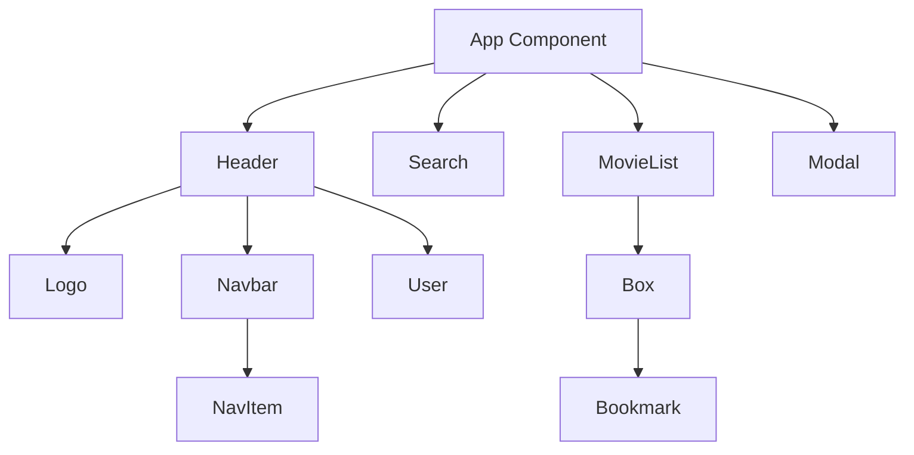

# System Patterns: Cine-Craze

## System Architecture

Cine-Craze follows a component-based architecture typical of React applications, with a focus on reusable UI components and centralized state management.

## Key Technical Decisions

### Component Structure

- **Atomic Design Approach**: The application uses a component hierarchy that follows atomic design principles, with small, reusable components (like NavItem, Bookmark) that combine to form larger components (like Navbar, Box).
- **Container/Presentational Pattern**: Components like MovieList serve as containers that manage the presentation of child components (Box).

### State Management

- **React Hooks**: The application uses React's useState and useEffect hooks for state management and side effects.
- **Prop Drilling**: State is passed down from parent to child components through props (e.g., query and setQuery from App to Search).

### API Integration

- **Fetch API**: The application uses the native Fetch API to make requests to the OMDB API.
- **Centralized API Calls**: All API calls are made from the App component, which then distributes data to child components.

### Styling Approach

- **Utility-First CSS**: Tailwind CSS is used for styling, following a utility-first approach.
- **Custom Color Scheme**: A custom color palette is defined in the Tailwind configuration.
- **Responsive Design**: The application is designed to be responsive across different screen sizes.

## Component Relationships

### App Component

- Acts as the main container for the application
- Manages the global state (query, movies, loading, error)
- Handles API calls and data fetching
- Renders the main layout and child components

### Header Component

- Contains the logo, navigation, and user profile
- Fixed position on the left side of the screen
- Houses the Navbar component for navigation

### Search Component

- Receives query state and setQuery function from App
- Handles user input for searching movies and TV series
- Updates the query state, triggering new API calls

### MovieList Component

- Receives movie data from App
- Renders a grid of Box components
- Handles the presentation of movie items

### Box Component

- Displays information for a single movie or TV series
- Contains the Bookmark component for saving items
- Shows movie details (title, year, type, rating)

### Modal Component

- Provides detailed view for selected movies/TV series
- Currently implemented as a placeholder

## Design Patterns

### Observer Pattern

- The application implements a simplified observer pattern through React's state and props system.
- When the query state changes, it triggers a re-render of components that depend on it.

### Conditional Rendering

- Components are conditionally rendered based on state (e.g., loading indicator, error messages).
- This pattern is used to handle different application states elegantly.

### Composition

- React's component composition is used extensively to build complex UIs from simpler components.
- This promotes reusability and separation of concerns.

## Future Architecture Considerations

### State Management Evolution

- As the application grows, consider implementing Context API or Redux for more complex state management.

### Routing

- Implement React Router for handling navigation between different sections.

### Data Caching

- Implement caching mechanisms for API responses to improve performance and reduce API calls.

### Authentication

- Add user authentication for personalized experiences and saved preferences across sessions.
